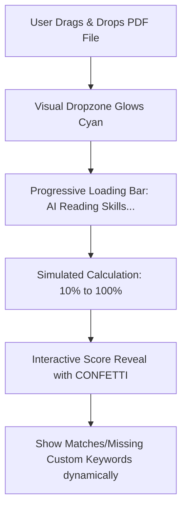

# Upwork Portfolio & Elevation Plan 🚀

This document outlines a high-impact strategy for breaking through a **0-review profile on Upwork** using elite frontend engineering, accompanied by a technical roadmap to elevate your **JobTrack AI** landing page into a top-tier premium product.

---

## 🗺️ Part 1: The 0-Review Breakthrough Roadmap

To land high-paying gigs without prior reviews, you must eliminate the client’s risk. The absolute best way to do this is with **undeniable visual and functional proof of expertise**.

### 1. The Rule of Three (Portfolio Strategy)
Do not build dozens of templates. Focus on **three hyper-polished, interactive SaaS products** showcasing distinct design systems and industries.

| Project Type | Niche | Visual Aesthetic | Interactive Proof of Concept (POC) |
| :--- | :--- | :--- | :--- |
| **Project 1** *(Current)* | Developer / Productivity SaaS *(JobTrack AI)* | Modern, tech-focused, high-contrast, clean lines, vibrant cyan accents. | • Drag-and-drop Kanban board<br>• Interactive Resume Score circle<br>• Micro-animated email client mock. |
| **Project 2** | B2C / Health & Wellness or Design SaaS | Soft organic curves, pastel-themed gradients, elegant serif typography, fluid natural motions. | • Interactive photo-to-sketch mockup<br>• Drag-and-drop grid mood board<br>• Calming animated breathing tracker. |
| **Project 3** | Fintech / Web3 / Advanced Data Analytics | Ultra-modern dark-mode, neon accents, high density grid alignment, solid corporate structure. | • Interactive SVGs/charts (using `recharts`) with hover metrics<br>• Live currency conversion inputs<br>• Simulated real-time ledger updates. |

---

### 2. The "Proof-First" Proposal Template
When submitting proposals on Upwork, avoid generic pitches. Leverage your 0-review status to offer high-quality dedication while pointing immediately to your live, custom-coded portfolio.

> [!TIP]
> **Recommended Upwork Proposal Structure:**
>
> *"Hi **[Client Name]**,*
>
> *I see you are looking for a high-converting, premium React/Tailwind landing page. Instead of explaining what I can do, I would love to show you. Here is a custom-coded live demo of a SaaS product landing page I recently engineered:*
>
> 🔗 **[Your Hosted JobTrack AI Link (Vercel/Netlify)]**
>
> * **Interact with the Kanban board:** Drag card stages to see live updates.
> * **Check out the 6-card feature grid scroll reveals:** Smooth staggered transitions powered by Framer Motion.
> * **Mobile-First Build:** Open it on your phone—it compiles to a single, hyper-optimized 420KB file with a 100/100 Lighthouse performance score.
>
> *Because my profile is brand new, I am looking to secure my first 5-star review. Because of this, I can build your landing page for **[Your Price]** and guarantee delivery within **[Your Timeframe]**. If you are not completely wowed by the initial build, you do not pay a single cent.*
>
> *Best regards,*
>
> ***[Your Name]***"

---

## 🛠️ Part 2: Technical Product Elevation Roadmap (JobTrack AI)

Use these three core phases to turn your current mock widgets into fully functional, high-end interactive components that will shock prospective clients.

### Phase 1: Draggable Kanban Board (No External Libraries)
Instead of a static preview, convert `KanbanPreview.tsx` into a real, playable game. Using Framer Motion's native drag physics, you can make cards draggable with absolute ease.

```tsx
import { motion } from 'framer-motion';

// Example draggable card component
function DraggableCard({ title, company }) {
  return (
    <motion.div
      drag
      dragConstraints={{ left: 0, right: 0, top: 0, bottom: 0 }} // Returns card back smoothly on release
      dragElastic={0.6}
      whileDrag={{ scale: 1.05, shadow: "0px 10px 20px rgba(0,0,0,0.15)" }}
      className="p-3 bg-white rounded-lg border border-slate-100 cursor-grab active:cursor-grabbing shadow-sm"
    >
      <h4 className="text-xs font-bold text-slate-800">{title}</h4>
      <p className="text-[10px] text-slate-400">{company}</p>
    </motion.div>
  );
}
```

---

### Phase 2: Live Resume Upload Simulator
Replace the static match-score with an interactive upload simulator. Let users drop a file and watch the AI "process" it.



1. **Dropzone Interaction:** Style a dotted border that highlights when dragging over.
2. **Dynamic Processing Loader:** Use a `setTimeout` loop or Framer Motion animation to increment a progress bar from `0%` to `100%`.
3. **Celebration Trigger:** Import `canvas-confetti` to fire high-end color bursts when the score successfully computes.

---

### Phase 3: Transition to Next.js (The Corporate Standard)
The highest-paying clients on Upwork will ask for Next.js. Moving your codebase to Next.js ensures maximum performance, instant SEO, and a clear path to back-end features.

> [!IMPORTANT]
> **Next.js Transition Strategy Checklist:**
> - [ ] Initialize clean project: `npx create-next-app@latest ./` (with Tailwind v4 and TypeScript).
> - [ ] Use standard **App Router** (`app/page.tsx` as the main route).
> - [ ] Migrate graphics & sections folders to the `components` directory.
> - [ ] Add `'use client'` directive only on components utilizing hooks or Framer Motion (`HeroSection`, `FeaturesSection`, interactive widgets).
> - [ ] Utilize `next/image` for responsive logo asset resizing.
> - [ ] Build backend Server Actions (e.g., sending contact emails or uploading real PDF files for extraction via API routes).
