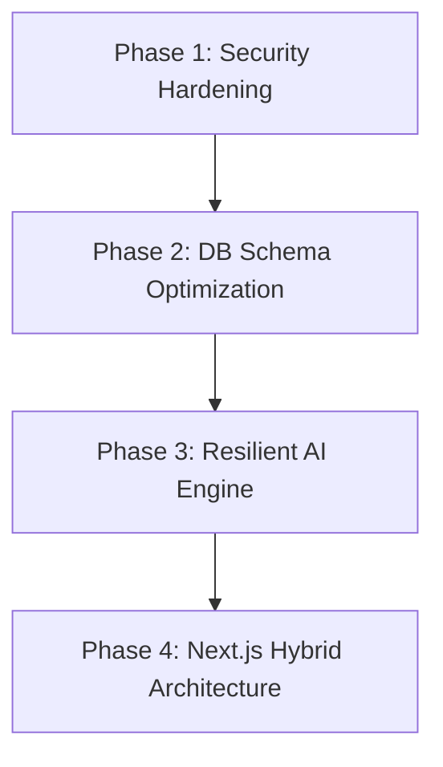

# ApplyAI Implementation & Hardening Plan

This plan lays out a structured, multi-phase roadmap to transform ApplyAI from a polished prototype into a production-grade, highly secure, and optimized full-stack application.

---

## User Review Required

> [!WARNING]
> **Phase 1 (Security Hardening)** modifies how API authentication is routed on the client side. We must verify that `process.env.API_KEY` isn't actively exposed under a `NEXT_PUBLIC_` prefix in the UI context.

---

## Proposed Multi-Phase Roadmap



---

## Phase 1: Security Hardening (Immediate)
* **Goal**: Eradicate client-side credential exposure and enforce secure Server-only calls.
* **Proposed Changes**:
  * Check and secure client-side fetch calls in `src/hooks/useRunAnalysis.ts`.
  * Ensure `NEXT_PUBLIC_API_KEY` is not exposed in public environment variables. Next.js Route Handlers naturally have access to server-side `process.env` keys without exposing them to the client browser.
  * Verify that API requests are routed securely via Clerk cookies in production.

---

## Phase 2: Database Schema & Query Optimization
* **Goal**: Keep WebSocket payloads lightweight, optimize queries, and support massive scale.
* **Proposed Changes**:
  * **Modifying [schema.ts](file:///c:/Users/moshu%20moshu/Desktop/apply-ai/convex/schema.ts)**:
    * Create a separate `analyses` table:
      ```typescript
      analyses: defineTable({
        applicationId: v.id("applications"),
        userId: v.string(),
        result: comparisonResult,
        updatedAt: v.string(),
      }).index("by_applicationId", ["applicationId"]).index("by_userId", ["userId"])
      ```
    * Strip the heavy nested `analysisResult` blob out of the `applications` table.
  * **Updating Queries & Mutations** in `convex/applications.ts` to reflect the table separation.
  * Implement compound indexes to enable lightning-fast pipeline board sorting and status transitions.

---

## Phase 3: Resilient AI Engine
* **Goal**: Eliminate JSON parsing crashes and move to native structured schemas.
* **Proposed Changes**:
  * Upgrade `src/app/api/compare/route.ts` to use Vercel AI SDK's native `generateObject` which enforces perfect schema validation and removes manual string cleaning hacks.
  * Build a robust JSON fallback parser for edge cases.

---

## Phase 4: Next.js Hybrid Architecture
* **Goal**: Implement server-side rendering, maximize core SEO benefits, and add visual loaders.
* **Proposed Changes**:
  * Transition standard pages from pure `"use client"` files to Server Components.
  * Wrap highly interactive states (like Modals and Kanban Drag/Drop) in Client Components.
  * Add custom Next.js `loading.tsx` loaders and robust `error.tsx` boundary handlers.

---

## Verification Plan

### Automated & Manual Verification
* Run local test suite using Bun:
  ```bash
  bun run build
  ```
* Test side-by-side analysis and check real-time updates inside the browser to verify Convex reactivity is unimpeded.
